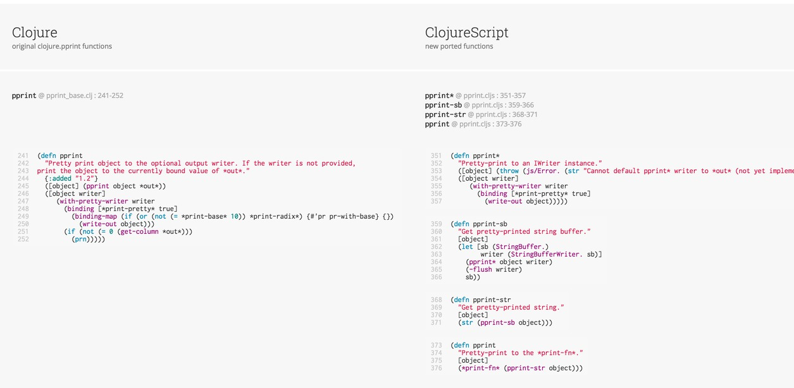

# cljs-pprint

__CLJS needs a pretty printer__ - Clojure has two pretty-printers available, which are being ported to ClojureScript:

- [`clojure.pprint`](https://clojure.github.io/clojure/clojure.pprint-api.html) - (comprehensive printer) being ported to cljs here, required by [CLJS-710](http://dev.clojure.org/jira/browse/CLJS-710)
- [`fipp`](https://github.com/brandonbloom/fipp) - (lightweight & fast) being ported to cljs at [fipp issue 7](https://github.com/brandonbloom/fipp/issues/7).

## Overview

- `src/clj` and `test/clj` has the original clojure pprint
- `src/cljs`  and `test/cljs` has the in-progress clojurescript pprint
- `src/parse` parses aforementioned source directories to generate data for a comparison report
- `src/report` page that displays a progress/comparison report and welcome page

[See docs for more notes](docs/)

## Running

```sh
# runs the parse tool
lein run

# runs report server at http://localhost:3449
rlwrap lein figwheel report
```

## Report

See the progress report here:

[](http://shaunlebron.github.io/cljs-pprint)

